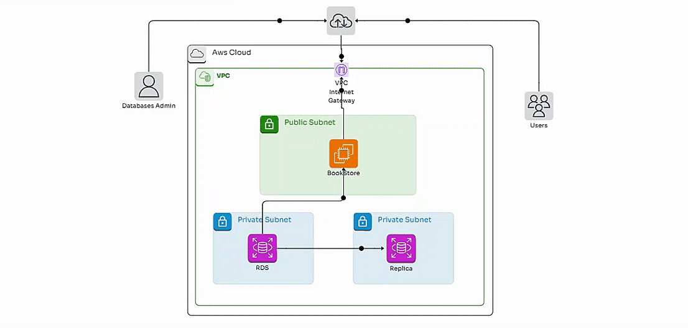

# ec2-rds-ssm-python

  

## I'm going to deploy the next cloud architecture on AWS

In this step, I'll be migrating the database on AWS EC2 to AWS RDS.
   
   - From the terminal of the AWS EC2 instance, I run the next commands:
   - I check the connection to AWS RDS from AWS EC2
     
             mysql -u root -p --host rds-endpoint
             show databases;
   
   
   - I begin with the migration with the next commands:
   
             mysqldump --databases books_db -u root -p > bookDB.sql
             mysql -u root -p --host *rds-endpoint* < bookDB.sql
   
   - You can check if the migration was successful
   
             mysql -u root -p --host *rds-endpoint*
             show databases;
             show tables;
             SELECT * FROM Books; 
